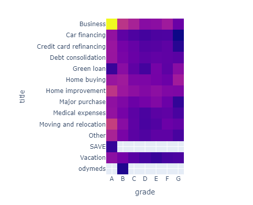
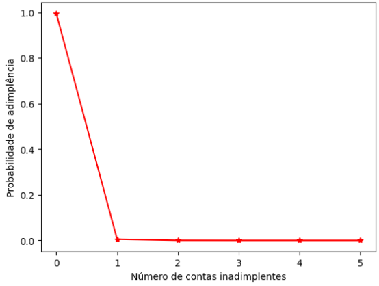
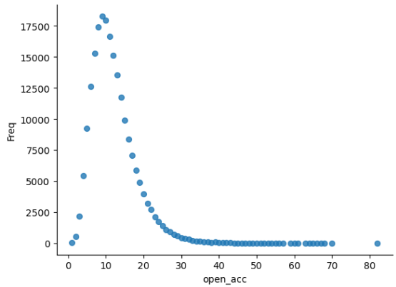
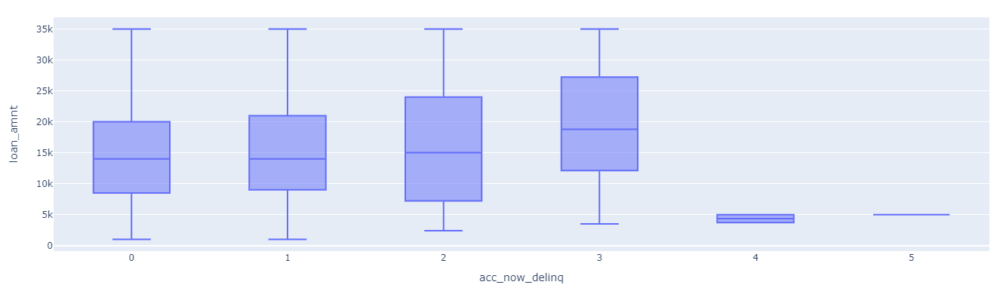
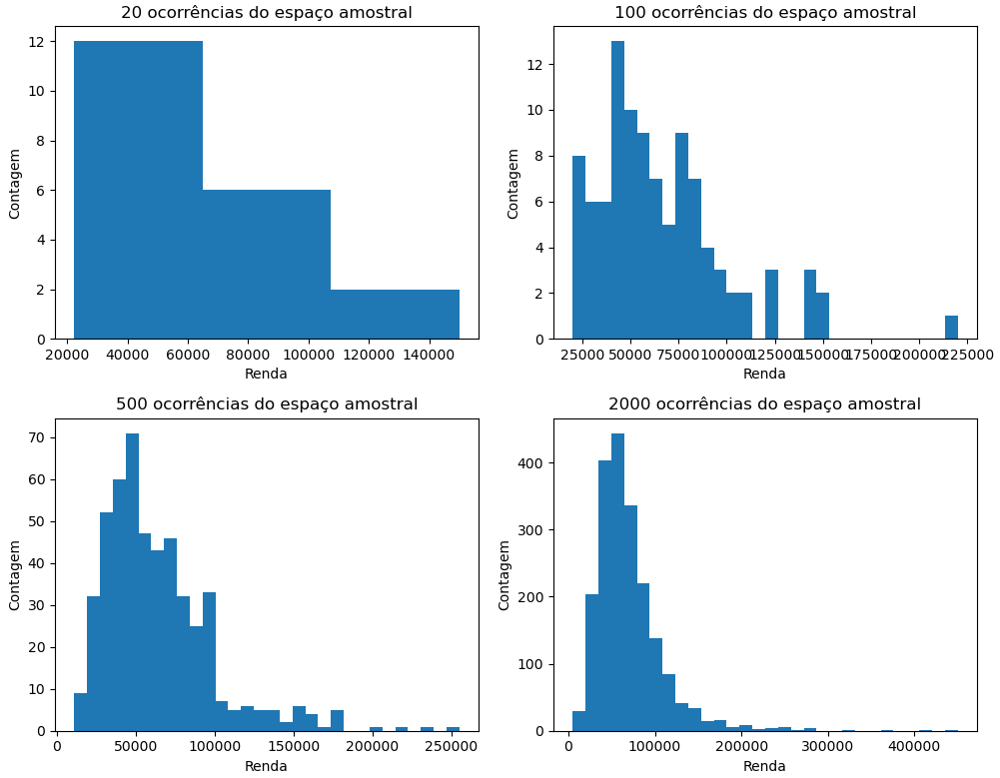

# Análise de risco de crédito com métodos estatísticos

Olá! Vamos explorar como conceitos estatísticos podem ser aplicados a uma análise de crédito real, analisando uma eventual proposta de um indivíduo chamado João, que está buscando um empréstimo para cumprir com as suas obrigações. A análise aplicará os conceitos não só ao indivíduo em si, mas também ao grupo no qual ele está inserido.

O dataset do projeto pode ser encontrado [neste link](https://www.kaggle.com/datasets/hetvigandhi03/loan-risk-analysis-dataset-real-world-data/discussion?sort=hotness).

## Apresentando o Caso de João

João é um jovem empreendedor classificado dentro do grupo E do dataset, onde se localizam mutuários de baixa performance e com um perfil de crédito não atrativo, seja em relação à inadimplência, score, renda anual, comprovação de renda, tipo de emprego, dentre outros dados importantes para a tomada de decisão na concessão de crédito.

João possui alguns dados interessantes para um perfil de classe E, então por que ele possui uma classificação tão baixa?

1) Ele está inadimplente (**acc_now_delinq** > 0)

2) Apesar de possuir uma renda anual de USD 95000, ele não possui comprovação de renda
3) Ele possui 35 linhas de crédito abertas. É um cliente que solicita crédito de maneira recorrente, o que indica dificuldades financeiras
4) Os dados deste empréstimo indicam que ele está solicitando dinheiro para pagar o cartão de crédito, o que é um péssimo indicativo de controle financeiro
5) João mora de aluguel

Por falar em aluguel, 39% dos solicitantes de empréstimos se encontram nesta situação, o que é um fator de atenção para a concessão de crédito para pessoas físicas! A probabilidade de inadimplência aumenta quando o indivíduo possui um aluguel a pagar, pois é uma dedução mensal garantida da sua renda. Ponto negativo para João! 

Olhando mais a fundo para o grupo dos inadimplentes, 36.81% deles solicitaram empréstimos para pagar o cartão de crédito, o que é um péssimo indicativo. Ora, se uma pessoa precisa de dinheiro emprestado para pagar uma dívida, qual a garantia de que ela vai poder pagar o empréstimo?

Com o mapa de calor abaixo, podemos analisar melhor a distribuição das finalidades de empréstimos de cada classe:

Um ponto extremamente importante da concessão de crédito é a manutenção de crédito, onde analisamos grupos que interessam e que não interessam, no intuito de mapear em quais grupos podemos aplicar diferentes estratégias de concessão e manutenção, como aumentar a concessão de crédito e os limites dos bons pagadores e grupos bem rankeados e bolar estratégias de recuperação, diminuição de limite ou até exclusão dos devedores da carteira de crédito. Por que focaríamos nossos esforços com indivíduos como João se 41.83% da nossa carteira de crédito possui casa própria ou tem emprego há mais de 10 anos? Indo além, ainda podemos criar uma nova classificação A+ para indivíduos que possuem ambas as características, ainda que seja um seleto grupo de 2.97%.

Estes bons grupos possuem altas rendas anuais. A média de renda do grupo A é de quase USD 95000, como João, mas diferente dele, o grupo A possui bons indicadores. Para se ter uma ideia, a probabilidade de um solicitante adimplente pedir um empréstimo, tal que não comprometa sua renda mensal em mais de 35%, é de 89.42%.

Para deixar a situação de João ainda mais difícil, podemos analisar a distribuição da quantidade de contas adimplentes e inadimplentes da carteira de crédito utilizando a variável aleatória **acc_now_delinq**.

Analisando com esta variável aleatória, fica evidente que não devemos conceder crédito para João.

Para fortalecer a nossa decisão, podemos ainda reforçá-la com os seguintes argumentos:

 - Dentro da análise de crédito, no contexto da nossa carteira, torna-se interessante a concessão do mesmo mediante a condição de o solicitante ter, no máximo, 10 linhas de crédito já abertas (a depender da sua classificação no dataset, o valor pode ser menor). O propósito deste tipo de critério serve para mitigar o risco de inadimplência.

 

 Seguindo um raciocínio semelhante, mas analisando as contas INADIMPLENTES, a partir de um determinado número, a quantidade do valor do empréstimo é diminuída significativamente, reiterando a importância do prêmio de risco do crédito (que também pode ser justificado com o aumento na taxa de juros).

Analisando o grupo E como um todo, podemos visualizar as distribuições amostrais de renda anual de acordo com o perfil do grupo. Em seguida, aumentaremos a quantidade de amostras para analisar o comportamento da distribuição à medida em que aumentamos, de maneira a observar a possível flutuação do salário de João, tornando mais previsível o comportamento de renda dele e possibilitando a tomada de decisão em relação à concessão de crédito.

Como decisão final, optamos por não conceder crédito para João, tendo em vista que:

1) Ele já está inadimplente
2) Não possui renda comprovada
3) Não tem garantias para pagamento de empréstimo
4) Possui 35 linhas de crédito em aberto
5) Está solicitando empréstimo para cobrir outras dívidas

